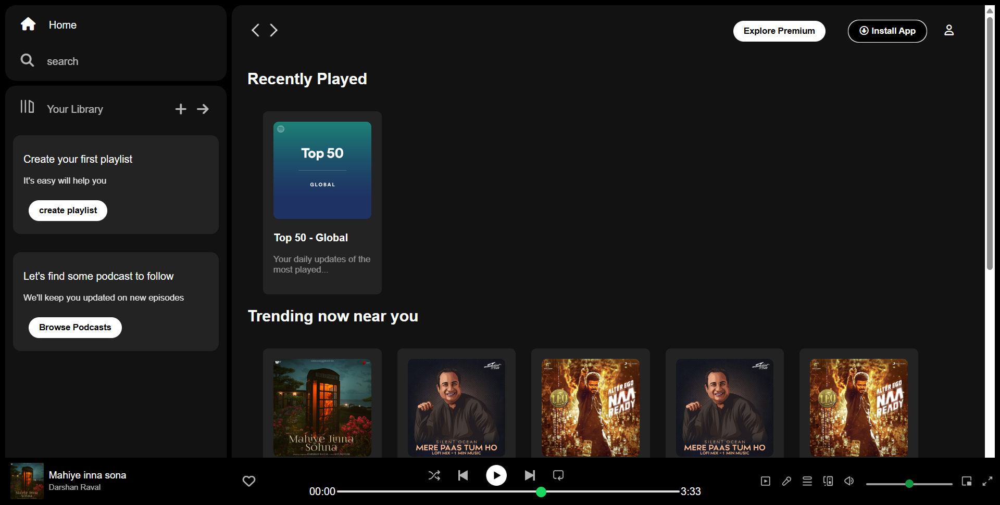

## Spotify Clone
A frontend project using HTML and CSS.

<br><br>
To run (or view) the web application locally
```
Clone the Repository:
    bash
    git clone https://github.com/your-username/'Spotify clone.git'
    cd 'Spotify clone'

Open the Website:
    Navigate to the web directory.
    Open the index.html file in your web browser.
```